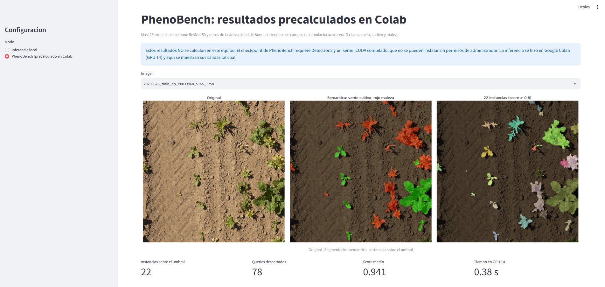
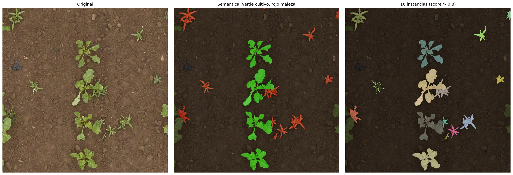
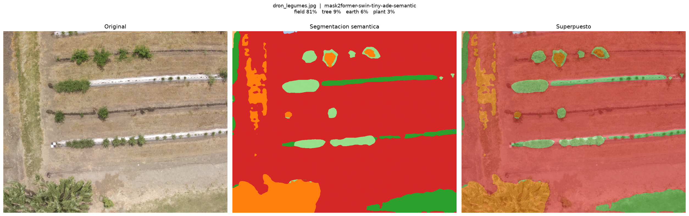
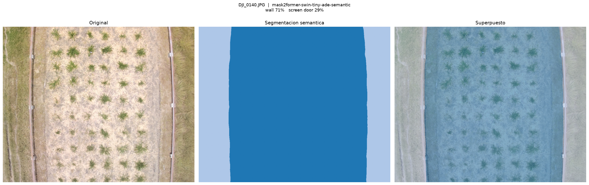
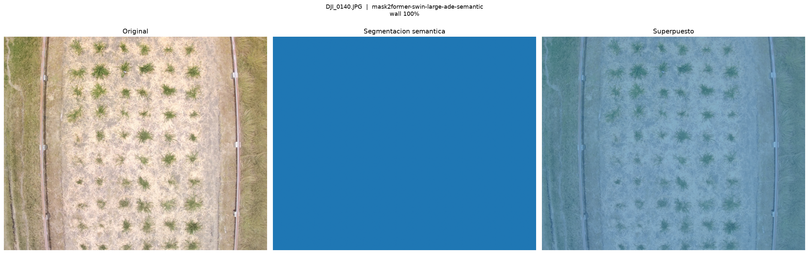

# Mask2Former aplicado a imágenes agrícolas de dron

**Proyecto final — Procesamiento de Datos Secuenciales**
Maestría en Inteligencia Artificial y Ciencia de Datos, Universidad Autónoma de Occidente

**Nombre:** María José Garzón Guiral

[](https://colab.research.google.com/github/MajoGGezz/mask2former-agricola/blob/main/notebooks/phenobench_mask2former_colab.ipynb)

---

## 1. Resumen

Este trabajo implementa la inferencia de **Mask2Former**, un Transformer encoder–decoder basado en queries para segmentación universal de imágenes, y lo aplica a la separación de cultivo, maleza y suelo en fotografías cenitales de dron. Usamos pesos preentrenados de terceros, sin entrenar nada: los de **PhenoBench** (Universidad de Bonn), afinados sobre campos de remolacha azucarera, y cuatro juegos de pesos genéricos de Hugging Face (COCO, ADE20K en dos tamaños y Mapillary Vistas).

El aporte principal es un análisis de **transferencia de dominio**: evaluamos la misma arquitectura con cinco juegos de pesos sobre imágenes propias de ensayos de forrajes tropicales. Ningún juego de pesos segmentó correctamente las plantas. En el caso más llamativo, un modelo de 215 millones de parámetros clasificó un ensayo agronómico completo como *pared*, con el 100 % de los píxeles, mientras que su versión de 47 millones dudaba entre dos clases. Concluimos que la arquitectura sí es universal, como afirma el título del artículo, pero los pesos no lo son, y que escalar el modelo aumenta la confianza en la respuesta equivocada en lugar de corregirla.

La solución incluye una aplicación interactiva en Streamlit que corre localmente y permite cargar una imagen, elegir el juego de pesos y observar la segmentación, las queries y los parámetros de la arquitectura.

---

## 2. Introducción

### Artículo base

> Cheng, B., Misra, I., Schwing, A. G., Kirillov, A. y Girdhar, R. (2022). *Masked-attention Mask Transformer for Universal Image Segmentation*. CVPR 2022. [arXiv:2112.01527](https://arxiv.org/abs/2112.01527)

- Repositorio original: https://github.com/facebookresearch/Mask2Former
- Pesos agrícolas y código de PhenoBench: https://github.com/PRBonn/phenobench-baselines
- Conjunto de datos PhenoBench: https://www.phenobench.org

### Contexto

En los programas de mejoramiento de cultivos, el fenotipado de campo se hace cada vez más con drones. Separar automáticamente qué píxeles son cultivo, cuáles maleza y cuáles suelo, y además individualizar cada planta, permite estimar cobertura, contar plantas y seguir su desarrollo sin medición manual. Esta tarea se llama **segmentación panóptica**.

### Motivación

Mask2Former es un Transformer encoder–decoder que hace algo análogo a la traducción automática: en lugar de relacionar palabras de un idioma con palabras de otro, **relaciona las máscaras de salida con los píxeles de entrada** mediante atención cruzada. Además, el benchmark PhenoBench reporta que Mask2Former es el que mejor desempeño general obtiene entre sus métodos de referencia, y un estudio reciente sobre cultivos (Duarte-Rangel et al., 2026) lo ubica primero entre siete arquitecturas para segmentación de vegetación en ortomosaicos de dron.

### Objetivo

Implementar el proceso de inferencia de Mask2Former con pesos preentrenados, explicar en detalle su arquitectura y su mecanismo de atención, y evaluar qué tan bien transfiere a imágenes de un dominio agrícola distinto al de entrenamiento.

---

## 3. Marco teórico

### 3.1 Arquitectura

Mask2Former tiene tres bloques:

| Bloque | Función |
|---|---|
| **Backbone** (ResNet-50 en PhenoBench, Swin en Hugging Face) | Convierte la imagen en mapas de características a cuatro resoluciones: 1/4, 1/8, 1/16 y 1/32 del tamaño original (res2 a res5) |
| **Pixel decoder** | Contiene el **encoder Transformer**: seis capas de atención deformable multiescala sobre res3, res4 y res5 |
| **Transformer decoder** | Diez capas: nueve útiles más una que existe solo para calcular la pérdida sobre las queries aprendidas |

Parámetros del modelo de PhenoBench, verificados en su archivo de configuración (`maskformer2_R50_bs16_90k.yaml`) y en el checkpoint:

| Parámetro | Valor |
|---|---|
| Queries de objeto | 100 |
| Capas del decoder | 10 (9 + 1) |
| Capas del pixel decoder | 6 |
| Dimensión oculta | 256 |
| Cabezas de atención | 8 |
| Dimensión por cabeza | 256 / 8 = 32 |
| Feed-forward | 2048 |
| Clases | 3 (+1 "sin objeto") |

Un detalle que conviene aclarar: en el config aparecen `ENC_LAYERS: 0` y `TRANSFORMER_ENC_LAYERS: 6`. No es una contradicción. El encoder Transformer del MaskFormer original está desactivado porque su función la cumple el pixel decoder deformable, que sí tiene seis capas de atención.

### 3.2 Mecanismo de atención

Toda la arquitectura se construye a partir del *scale dot product*. La auto-atención básica,

$$y = \text{Softmax}(X X^T)\, X$$

no aprende nada porque no tiene parámetros. Por eso se introducen tres proyecciones lineales aprendidas:

$$Q = W_q X \qquad K = W_k X \qquad V = W_v X$$

$$y = \text{Softmax}\!\left(\frac{Q K^T}{\sqrt{d_k}}\right) V$$

Con $d_k = 32$, el factor de escala es $1/\sqrt{32} \approx 0.177$.

Intuitivamente: **Q** es lo que se está buscando, **K** es lo que cada elemento dice que es, y **V** es el contenido que efectivamente se transfiere. El producto $QK^T$ mide la compatibilidad entre lo que se busca y lo que se ofrece; el softmax la convierte en porcentajes, y esos porcentajes ponderan a $V$.

### 3.3 Cómo se generan Q, K y V en Mask2Former

El modelo tiene **tres mecanismos de atención distintos**, y en cada uno Q, K y V provienen de lugares diferentes:

**a) Atención deformable del pixel decoder (6 capas).** Q, K y V salen de la imagen. Q es cada token de píxel de los mapas res3 a res5; K y V son unos pocos puntos muestreados con desplazamientos aprendidos, en las tres escalas a la vez. Al atender solo a unos puntos en lugar de a todos, el costo pasa de cuadrático a lineal en el número de píxeles, lo que permite trabajar con imágenes de 1024 px.

**b) Self-attention entre queries (9 capas).** Q, K y V salen del mismo tensor: las 100 queries. Cada query atiende a las otras 99, lo que les permite coordinarse para no reclamar el mismo objeto.

**c) Atención cruzada enmascarada (9 capas).** Es el mecanismo central:

| Tensor | Origen | Significado en nuestro problema |
|---|---|---|
| **Q** | Las 100 queries aprendidas (`query_feat`, forma 100×256) | Cien hipótesis de objeto: "podría haber una planta en alguna parte" |
| **K** | Características de píxel del pixel decoder | Descriptor de cada región de la imagen |
| **V** | Las mismas características de píxel | La información que se transfiere a la query |

Es el mismo esquema de la traducción automática: **K y V vienen de la entrada del problema, y Q viene de la salida**. En traducción, Q son las palabras que se generan y K, V las del idioma original; aquí Q son las máscaras que se construyen y K, V los píxeles de la imagen.

La diferencia entre self-attention y cross-attention se ve directamente en el código. La primera hace una sola proyección y la divide en tres:

```python
q, k, v = self.to_qkv(x).chunk(3, dim=-1)
```

La segunda hace dos proyecciones separadas sobre dos fuentes distintas:

```python
q  = self.q(x)          # x: las queries
kv = self.kv(context)   # context: los píxeles
```

### 3.4 Innovaciones del artículo

1. **Atención enmascarada.** En cada capa, la atención de una query se restringe a la región donde esa misma query predijo su máscara en la capa anterior; el resto se pone en $-\infty$, que tras el softmax da exactamente cero. Así cada query refina su propio objeto en lugar de competir con la señal de toda la imagen. Los autores muestran que mejora el desempeño sin costo computacional adicional.
2. **Pixel decoder con atención deformable multiescala**, que reemplaza al encoder Transformer convencional y reduce el costo de cuadrático a lineal.
3. **Pérdida calculada sobre puntos muestreados** en lugar de máscaras completas, lo que abarata mucho el entrenamiento.
4. **Universalidad.** La misma arquitectura resuelve segmentación semántica, de instancias y panóptica, cuando antes se requería un modelo especializado para cada una.

### 3.5 Por qué la salida no necesita NMS

El decoder emite siempre **exactamente 100 predicciones**, haya los objetos que haya. La clasificación tiene una clase extra, "sin objeto": las queries que no encuentran nada concentran ahí su probabilidad y se descartan. Durante el entrenamiento, un emparejamiento bipartito óptimo asigna cada objeto real a una sola query. Por eso el modelo no propone regiones redundantes y no necesita supresión de no-máximos.

---

## 4. Metodología

### Herramientas

| Herramienta | Uso |
|---|---|
| Python 3.13, PyTorch (CPU) | Inferencia local |
| Hugging Face `transformers` | Carga de Mask2Former con pesos genéricos |
| Detectron2 | Carga del checkpoint de PhenoBench (solo en Colab) |
| Google Colab (GPU T4) | Compilación del kernel deformable e inferencia con PhenoBench |
| Streamlit | Interfaz interactiva local |

### Pesos preentrenados

No se entrenó ningún modelo. Se usaron cinco juegos de pesos sobre la misma arquitectura:

| Pesos | Origen | Clases | Parámetros |
|---|---|---|---|
| PhenoBench R50 | Universidad de Bonn | 3 (suelo, cultivo, maleza) | 44 M (según el artículo) |
| COCO tiny | `facebook/mask2former-swin-tiny-coco-instance` | 80 | 47.4 M |
| ADE20K tiny | `facebook/mask2former-swin-tiny-ade-semantic` | 150 | 47.4 M |
| ADE20K large | `facebook/mask2former-swin-large-ade-semantic` | 150 | 215.5 M |
| Mapillary Vistas large | `facebook/mask2former-swin-large-mapillary-vistas-semantic` | 65 | 215.5 M |

### Por qué dos entornos

El checkpoint de PhenoBench está en formato Detectron2 y necesita compilar un kernel CUDA propio para la atención deformable. Esto no es viable en un equipo corporativo sin permisos de administrador, y la conversión al formato de Hugging Face tampoco es posible porque su implementación de Mask2Former solo admite backbone Swin, mientras que PhenoBench usa ResNet-50.

La solución fue separar: **PhenoBench corre en Colab**, y los otros cuatro juegos de pesos corren **localmente**, porque la implementación de Hugging Face trae la atención deformable escrita en PyTorch puro, sin extensiones compiladas.

### Diseño del experimento

Se evaluaron las cinco configuraciones sobre tres imágenes propias de dron, tomadas en ensayos de forrajes tropicales, que se alejan del dominio de PhenoBench en cultivo (gramíneas y arbustivas frente a remolacha), altura de vuelo (mayor), fondo (plástico de acolchado y residuo vegetal frente a suelo desnudo) y estado de desarrollo (plantas establecidas frente a plántulas).

---

## 5. Desarrollo e implementación

### Estructura del repositorio

```
├── app.py                    Aplicación interactiva (Streamlit)
├── evaluar_mask2former.py    Evaluación por lotes con cualquier juego de pesos
├── requirements.txt          Dependencias
├── notebooks/
│   └── phenobench_mask2former_colab.ipynb   Inferencia con PhenoBench en Colab
├── imagenes/                 Imágenes propias de dron usadas en las pruebas
└── resultados/               Figuras y capturas generadas
    └── phenobench/           Salidas de PhenoBench exportadas desde Colab
```

### Ejecución local

```bash
python -m venv .venv
.venv\Scripts\activate                     # Windows
pip install torch torchvision --index-url https://download.pytorch.org/whl/cpu
pip install -r requirements.txt
```

**Aplicación interactiva:**

```bash
streamlit run app.py
```

Se abre en `http://localhost:8501`. Desde el panel lateral se carga una imagen y se elige el juego de pesos.

**Evaluación por lotes:**

```bash
python evaluar_mask2former.py imagenes/dron_legumes.jpg imagenes/DJI_0140.JPG
python evaluar_mask2former.py imagenes/DJI_0140.JPG --modelo facebook/mask2former-swin-large-ade-semantic
```

Genera una figura de tres paneles por imagen en la misma carpeta y una tabla comparativa en consola.

### Ejecución con PhenoBench (Colab)

Abrir `notebooks/phenobench_mask2former_colab.ipynb` en Google Colab con entorno GPU T4 y seguir las secciones en orden. Las secciones 1 a 3 se ejecutan una sola vez e incluyen dos correcciones al código CUDA original, necesarias porque usa APIs de PyTorch que ya no compilan:

| Línea | Original | Corrección |
|---|---|---|
| 39, 105 | `value.type().is_cuda()` | `value.is_cuda()` |
| 69, 139 | `value.type()` en `AT_DISPATCH` | `value.scalar_type()` |

El orden importa: si se reemplazan todas las apariciones de `value.type()` de una vez, las líneas 39 y 105 se rompen.

### Cómo se llevan los resultados de Colab a la aplicación local

La sección 11 del notebook corre PhenoBench sobre un lote de imágenes y descarga `phenobench_export.zip`, con una figura por imagen y un `resumen.json` con la cobertura por clase, las instancias sobre el umbral, el score medio y el tiempo de inferencia. Al descomprimirlo en `resultados/phenobench/`, la aplicación lo muestra en su modo **PhenoBench (precalculado en Colab)**, que además incluye un botón para abrir el notebook y repetir la inferencia en vivo. De esta forma los cinco juegos de pesos quedan accesibles desde una sola interfaz, aunque uno de ellos no pueda ejecutarse en el equipo local.

Para que el botón funcione, en `app.py` y en este README reemplazar `<usuario>` por el usuario de GitHub.

### Cómo se cargan los pesos

**Hugging Face.** `from_pretrained()` descarga el checkpoint la primera vez y lo deja en caché:

```python
proc  = AutoImageProcessor.from_pretrained(MODELO)
model = Mask2FormerForUniversalSegmentation.from_pretrained(MODELO).eval()
```

Al cargar aparece un aviso de claves `MISSING` (`swin.layernorm`) y `UNEXPECTED` (`relative_position_index`). Es benigno: el primero es una normalización final que Mask2Former no usa porque toma las características intermedias del backbone, y el segundo es un buffer que se recalcula solo.

**PhenoBench.** Detectron2 construye el modelo desde el archivo de configuración y luego carga el checkpoint:

```python
cfg.merge_from_file(CONFIG)
cfg.MODEL.WEIGHTS = '/content/phenobench_panoptic.pth'
predictor = DefaultPredictor(cfg)
```

La inspección del checkpoint (176 MB, 611 tensores) confirmó que coincide con el config: `query_feat` de forma (100, 256) y `class_embed` de forma (4, 256), es decir, tres clases más "sin objeto".

### Preprocesamiento

1. Lectura de la imagen en RGB.
2. Redimensionamiento a un lado máximo de 1024 px, conservando la proporción.
3. Normalización. **Depende del origen de los pesos**: Hugging Face usa media y desviación de ImageNet; el checkpoint de PhenoBench, al tener `PIXEL_MEAN` y `PIXEL_STD` comentados en su config, usa los valores por defecto de Detectron2, que restan la media en orden BGR y dejan la desviación en 1.0. Equivocarse aquí no produce error al cargar, pero arruina las predicciones.

El resultado es un tensor `[1, 3, H, W]`; una foto de 1600×1300 entra como `[1, 3, 832, 1024]`.

### Inferencia y salidas

El modelo devuelve dos tensores:

```
masks_queries_logits : [1, 100, H/4, W/4]   una máscara por query
class_queries_logits : [1, 100, K+1]        una distribución de clases por query
```

El postprocesamiento los combina según la tarea: `post_process_semantic_segmentation` produce un mapa con una clase por píxel, y `post_process_instance_segmentation` produce una máscara y un score por objeto.

---

## 6. Resultados y análisis

### 6.1 La aplicación



La interfaz tiene dos modos. En **inferencia local** corre Mask2Former con los cuatro juegos de pesos de Hugging Face y muestra cuatro pestañas: **Segmentación** (original, mapa de clases, superposición y tabla de cobertura), **Queries** (cuántas de las 100 encontraron objeto y las seis más activas), **Atención cruzada** y **Arquitectura** (parámetros del modelo cargado). En **PhenoBench (precalculado en Colab)** muestra las salidas exportadas desde Colab, etiquetadas como tales, con un enlace para reproducirlas.

### 6.2 PhenoBench en su propio dominio



Sobre dos imágenes del conjunto oficial de PhenoBench, una de entrenamiento y una de validación, el modelo funciona como se espera:

| Imagen | Suelo | Cultivo | Maleza | Instancias (score > 0.8) | Score medio |
|---|---|---|---|---|---|
| `20200526_train_nh_P0033960` | 89.2 % | 4.5 % | 6.3 % | 22 (7 cultivo, 15 maleza) | 0.941 |
| `20200605_val_ph_P0037821` | 93.1 % | 4.7 % | 2.2 % | 16 (4 cultivo, 12 maleza) | 0.970 |

Las proporciones son coherentes con plántulas de remolacha separadas sobre suelo desnudo, y los scores medios por encima de 0.94 indican predicciones confiables. Esto confirma que la carga del checkpoint, la normalización y el postprocesamiento son correctos. La imagen de validación es la referencia más exigente, porque pertenece a la partición que el modelo no usó para entrenar.

### 6.3 Transferencia a imágenes propias

**ADE20K tiny** sobre las tres imágenes (% de píxeles):

| Clase | dron_legumes | dron_legumes_2 | DJI_0140 |
|---|---|---|---|
| field | 81.1 | — | — |
| earth | 6.5 | 60.3 | — |
| grass | — | 23.3 | — |
| tree | 8.8 | — | — |
| plant | 3.5 | 0.9 | — |
| fence | — | 12.3 | — |
| road | — | 2.3 | — |
| water | — | 0.6 | — |
| wall | — | — | 71.4 |
| screen door | — | — | 28.6 |

**Mapillary Vistas large** sobre las mismas imágenes:

| Clase | dron_legumes | dron_legumes_2 | DJI_0140 |
|---|---|---|---|
| Terrain | 69.8 | 97.1 | — |
| Vegetation | 15.8 | — | — |
| Road | 8.6 | 2.4 | — |
| Wall | 5.0 | — | — |
| Fence | 0.8 | — | — |
| Building | — | — | 100.0 |



Sobre `dron_legumes.jpg`, ADE20K produce una segmentación coherente: el árbol de la esquina queda aislado como `tree` y las camas de cultivo como `field`. Sobre `dron_legumes_2.jpg` aparecen confusiones específicas: el 12.3 % de `fence` corresponde al plástico gris del acolchado, que por su forma alargada se interpreta como una cerca. Mapillary, con un vocabulario más pequeño, colapsa esta imagen casi entera en `Terrain` y pierde las manchas de vegetación que ADE20K sí distinguía.

### 6.4 El caso del ensayo en cuadrícula

La imagen `DJI_0140.JPG` muestra un ensayo agronómico con las plantas dispuestas en cuadrícula regular sobre residuo vegetal claro. Es la comparación más reveladora:

| Pesos | Parámetros | Resultado |
|---|---|---|
| ADE20K tiny | 47.4 M | wall 71.4 %, screen door 28.6 % |
| ADE20K large | 215.5 M | **wall 100 %** |
| Mapillary large | 215.5 M | **Building 100 %** |





La comparación entre ADE20K tiny y large es la más limpia, porque solo cambia el tamaño del backbone: mismo dataset, mismas 150 clases, mismo procesamiento. El modelo pequeño dudaba entre dos clases; el grande se comprometió con una sola al 100 %. Y los dos modelos grandes, entrenados con datasets distintos, coinciden en la misma categoría conceptual de superficie construida.

**Interpretación.** Las claves y los valores de la atención codifican **textura y geometría, no significado agronómico**. Una cuadrícula regular de elementos sobre fondo claro, flanqueada por dos líneas paralelas, es estructuralmente equivalente a una fachada. Como el dominio agrícola no existe en los datos de entrenamiento de ADE20K ni de Mapillary, las queries convergen hacia la categoría cuya estructura visual más se aproxima.

### 6.5 COCO y PhenoBench

Con los pesos de **COCO**, sobre una imagen de dron de 5472×3648 px el modelo no produjo ninguna detección: las 100 queries votaron por "sin objeto". COCO tiene 80 clases cotidianas y urbanas, ninguna aplicable a un lote de cultivo.

Con los pesos de **PhenoBench** el resultado es más sutil, y más revelador:

| Imagen | Suelo | Cultivo | Maleza | Instancias (score > 0.8) | Score medio |
|---|---|---|---|---|---|
| `dron_legumes` | 90.0 % | 6.3 % | 3.8 % | 22 (2 cultivo, 20 maleza) | 0.932 |
| `DJI_0140` | 92.3 % | 1.4 % | 6.3 % | 33 (7 cultivo, 26 maleza) | 0.911 |
| `159395_Pgc_img_cm` | 77.2 % | 20.4 % | 2.4 % | 7 (1 cultivo, 6 maleza) | 0.850 |

El modelo sí detecta plantas, y con scores altos, pero las clasifica mayoritariamente como **maleza**. En `DJI_0140`, donde las plantas dispuestas en cuadrícula son el cultivo sembrado del ensayo, 26 de 33 instancias quedan como maleza con un score medio de 0.91. Una hipótesis plausible es agronómica: en los campos de remolacha de PhenoBench el cultivo es de hoja ancha y las gramíneas son malezas comunes, de modo que un modelo que aprendió esa asociación interpreta una gramínea forrajera como maleza. Es el mismo patrón observado con los pesos genéricos: un error sistemático cometido con confianza alta.

Las diferencias de dominio que lo explican:

| | PhenoBench | Nuestras imágenes |
|---|---|---|
| Cultivo | Remolacha, hoja ancha en roseta | Gramíneas y arbustivas |
| Resolución | Cada hoja visible en detalle | Una planta ocupa decenas de píxeles |
| Fondo | Suelo desnudo | Plástico, residuo seco, pasto |
| Estado | Plántulas separadas | Plantas establecidas |

### 6.6 Métricas

Las métricas reportadas son la cobertura por clase, el número de instancias que superan el umbral de confianza de 0.8 y el tiempo de inferencia, que con PhenoBench en una GPU T4 fue de 0.36 a 0.46 segundos por imagen.

Como referencia externa, Duarte-Rangel et al. (2026) evaluaron Mask2Former entrenado sobre ortomosaicos de nopal y obtuvieron IoU de 0.897 en ese cultivo. Al consolidar un modelo con datos de nopal y agave, el IoU fue 0.894 y 0.760 respectivamente, usando solo el 6.84 % de los mosaicos de agave para el ajuste.

---

## 7. Conclusiones

### Aprendizajes

- Mask2Former es un Transformer encoder–decoder en el sentido estricto: su atención cruzada sigue el mismo esquema que la traducción automática, con Q proveniente de la salida (las queries) y K, V provenientes de la entrada (los píxeles).
- El modelo tiene tres mecanismos de atención distintos, y en cada uno Q, K y V significan algo diferente.
- **La arquitectura es universal; los pesos no lo son.** El título del artículo se refiere a que la misma arquitectura resuelve varias tareas, no a que unos mismos pesos funcionen en cualquier dominio.
- **Escalar el modelo no corrige el desajuste de dominio.** El modelo de 215 M de parámetros cometió el mismo error que el de 47 M, pero con más confianza.
- Pesos más específicos no implican mejor transferencia. Los de PhenoBench, entrenados en agricultura, detectan nuestras plantas con confianza alta pero las clasifican mayoritariamente como maleza: su especialización en un cultivo de hoja ancha los vuelve sistemáticamente errados ante gramíneas.

### Limitaciones

- No se dispone de anotaciones para las imágenes propias, por lo que el análisis es cualitativo y por cobertura, no por IoU.
- Los pesos de PhenoBench no pueden ejecutarse en la aplicación local por depender de Detectron2 y de un kernel CUDA compilado. Sus resultados se calculan en Colab y la aplicación los muestra precalculados, no en vivo.
- La pestaña de atención cruzada de la aplicación depende de que la versión instalada de `transformers` exponga los pesos de atención.
- Se evaluaron solo tres imágenes propias.

### Posibles mejoras

- **Ajustar la altura de vuelo** para igualar los píxeles por órgano vegetal a los del conjunto de entrenamiento, como proponen Duarte-Rangel et al. (2026), en lugar de igualar la altura.
- **Ajuste fino con pocas anotaciones** del dominio objetivo. El mismo estudio muestra que menos del 7 % de datos etiquetados recupera buena parte del desempeño.
- **Exportar el modelo de PhenoBench a ONNX** desde Colab para ejecutarlo localmente con `onnxruntime`, sin Detectron2.
- Anotar un subconjunto de imágenes propias para calcular métricas cuantitativas.

---

## 8. Referencias

1. Cheng, B., Misra, I., Schwing, A. G., Kirillov, A. y Girdhar, R. (2022). Masked-attention Mask Transformer for Universal Image Segmentation. *Proceedings of the IEEE/CVF Conference on Computer Vision and Pattern Recognition (CVPR)*. https://arxiv.org/abs/2112.01527
2. Weyler, J., Magistri, F., Marks, E., Chong, Y. L., Sodano, M., Roggiolani, G., Chebrolu, N., Stachniss, C. y Behley, J. (2023). PhenoBench: A Large Dataset and Benchmarks for Semantic Image Interpretation in the Agricultural Domain. https://arxiv.org/abs/2306.04557
3. Duarte-Rangel, A., Camacho-Bello, C., Cornejo-Velazquez, E. y Clavel-Maqueda, M. (2026). Deep Learning for Semantic Segmentation in Crops: Generalization from Opuntia spp. *AgriEngineering*, 8(1), 18. https://www.mdpi.com/2624-7402/8/1/18
4. Vaswani, A. et al. (2017). Attention Is All You Need. *Advances in Neural Information Processing Systems*. https://arxiv.org/abs/1706.03762
5. Zhu, X. et al. (2021). Deformable DETR: Deformable Transformers for End-to-End Object Detection. *ICLR*. https://arxiv.org/abs/2010.04159
6. Repositorio oficial de Mask2Former: https://github.com/facebookresearch/Mask2Former
7. Baselines de PhenoBench: https://github.com/PRBonn/phenobench-baselines
8. Implementación en Hugging Face: https://huggingface.co/docs/transformers/model_doc/mask2former
